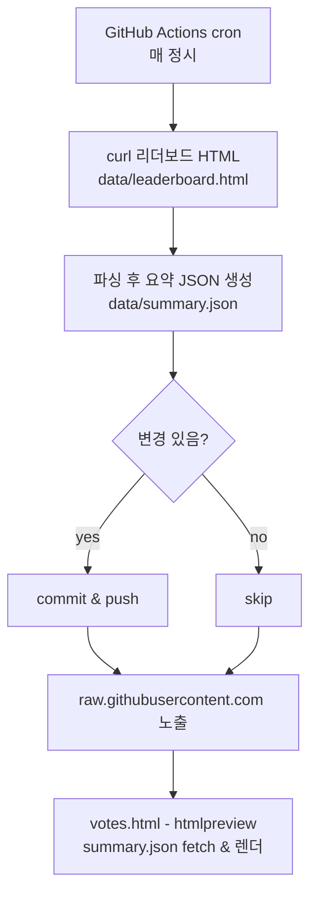

# vote-dashboard

간편하게 `votes.html`을 공유·확인할 수 있는 대시보드입니다.

- 미리보기 링크(iframe 우회): https://htmlpreview.github.io/?https://raw.githubusercontent.com/sesacs/vote-dashboard/main/votes.html
- 원본 raw 파일: https://raw.githubusercontent.com/sesacs/vote-dashboard/main/votes.html

사용법
- 위 미리보기 링크를 그대로 공유하면 브라우저에서 바로 렌더링됩니다.
- `votes.html`은 GitHub에 저장된 사전 계산 스냅샷(`data/summary.json`)만 읽으므로 CORS 문제 없이 동작합니다.
- 스냅샷은 `.github/workflows/update-leaderboard.yml`가 30분마다 HTML을 받아 `data/leaderboard.html`과 `data/summary.json`을 갱신하려고 시도합니다. 필요 시 수동으로 HTML을 받아 `data/leaderboard.html`을 업데이트한 뒤, 로컬에서 `python3`로 `data/summary.json`을 재생성하고 `git push`하면 즉시 반영됩니다.
- codeshare 조회수가 낮은 팀 30개 중 5개를 랜덤으로 골라 보여줍니다.

작동 흐름

