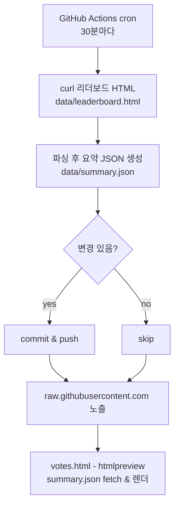

# vote-dashboard

간편하게 `votes.html`을 공유·확인할 수 있는 대시보드입니다.  
GitHub Pages 수준의 가벼운 배포로, 해커톤 참가자들이 서로의 시도를 더 잘 발견하도록 돕습니다.

## 왜 만들었나요
- 데이콘 해커톤 개최에 늘 감사하지만, 작년과 마찬가지로 앞서간 몇몇 프로젝트들 외에 다수의 팀이 묻히는 점이 뭍힐 수 밖에 없는 데이콘 UI 때문에 아쉬운 마음에 작성하게 되었습니다.
- 조회수가 낮은 게시글도 다시 앞단에 노출해, 하위 팀의 시도도 쉽게 확인되도록 하는 것이 목표입니다.
- 하위팀 말고도 데이콘 모든 참가자 분들이 확인할 수 있는 남은 투표 수 현황판도 간단하게 만들었습니다.
- 작년 경험을 바탕으로 빠르게 공유할 수 있도록 GitHub.io 방식으로 배포했습니다.

## 바로 보기
- 링크: https://htmlpreview.github.io/?https://raw.githubusercontent.com/sesacs/vote-dashboard/main/votes.html?v=20250204
  - htmlpreview가 캐싱할 때가 있어, `?v=...` 파라미터를 바꿔주면 최신 파일을 강제로 불러옵니다.
- 원본 html 파일: https://raw.githubusercontent.com/sesacs/vote-dashboard/main/votes.html

## 특징
- snapshot 기반: `data/summary.json`만 읽어 CORS 걱정 없이 동작합니다.
- 캐시 버스터 적용: 매 요청마다 캐시를 비켜 새 데이터를 읽습니다.
- 저조회 팀 재노출: codeshare 조회수 하위 30개 중 5개를 랜덤으로 띄워 더 많은 팀이 홍보되도록 합니다.

## 사용법
1) 위 미리보기 링크를 그대로 공유하면 브라우저에서 바로 렌더링됩니다.  
2) 스냅샷이 필요하면 `.github/workflows/update-leaderboard.yml`가 30분마다 HTML을 받아 `data/leaderboard.html`과 `data/summary.json`을 갱신하려고 시도합니다.  
3) 필요 시 수동으로 HTML을 받아 `data/leaderboard.html`을 업데이트한 뒤, 로컬에서 `python3`로 `data/summary.json`을 재생성하고 `git push`하면 즉시 반영됩니다.

## 작동 흐름

바이브 코딩으로 필요한 최소 기능만 빠르게 구현했습니다.
